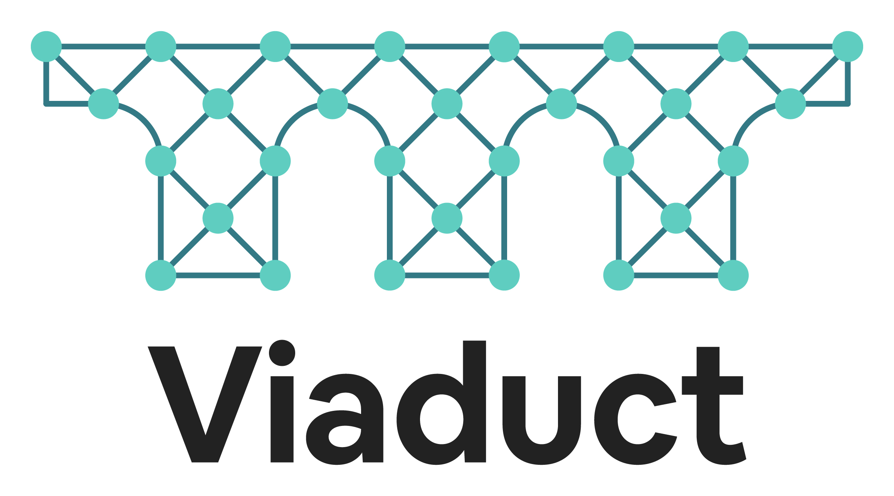

<p align="center">
  <a href="https://airbnb.io/viaduct">
    
  </a>
</p>
<p align="center">
    <b>Viaduct is a GraphQL-based system that provides a unified interface for accessing and interacting with any data source.</b>
</p>
<p align="center">
    See the <a href="https://airbnb.io/viaduct/docs/">User Manual</a> for deployment instructions and end user documentation.
</p>

> [!WARNING]
> The Viaduct engine is in production, at scale, at Airbnb where it has proven reliable. The developer API of Viaduct is under active development. In [our roadmap](https://airbnb.io/viaduct/roadmap) we indicate which parts of the API are more or less subject to future change.  This is a good time to join the project and influence the direction that this API takes!

# Vision

Viaduct is an open source data-oriented service mesh. As an open source initiative, Viaduct is committed to fostering an inclusive and collaborative community where external developers can contribute, innovate, and help shape the future of data-oriented development.

Three principles have guided Viaduct since day one and still anchor the project: a central schema served by hosted business logic via a re-entrant API.
* Central Schema: Viaduct serves a single, integrated schema connecting all of your domains across your company---the central schema.  While that schema is developed in a decentralized manner by many teams, it’s one, highly connected graph.
* Hosted Business Logic: Teams should host their business logic directly in Viaduct.  This runs counter to what many consider to be best practices in GraphQL, which is that GraphQL servers should be a thin layer over microservices that host the real business logic.  Viaduct is a serverless platform for hosting business logic, allowing developers to focus on writing business logic rather than on operational issues.
* Re-entrancy: At the heart of Viaduct's developer experience is what we call re-entrancy: Logic hosted on Viaduct composes with other logic hosted on Viaduct by issuing GraphQL fragments and queries.  Re-entrancy is crucial for maintaining modularity in a large codebase and avoiding classic monolith hazards.

This vision embodies our commitment to creating a thriving open source project that not only meets internal Airbnb needs but also provides value to the wider developer community in building powerful, scalable applications with ease and confidence.

## Getting Started

Using a set of scripts bundled with the Viaduct release, this document will walk you through the process of running a very simple Viaduct application.  Viaduct comes with built-in, Gradle-based tooling for building, testing, and running your sample application.  This guide uses that tooling and assumes a basic familiarity with Gradle.

### System Requirements

Java 21 must be on the path or available via `JAVA_HOME`.

### Running the Simple Application

Viaduct comes with a number of demonstration applications you can find in the `demoapps` directory.  Let’s start with the `demoapps/cli-starter` application.  Change into that directory and type:

```
./gradlew -q run --args="'{ author }'"
```

This command will build the simple application run a graphql query with Viaduct.

### Using Viaduct in your own application

Currently, Viaduct is only published to Maven Central as snapshot versions. To use Viaduct in your own application, add the following to your `build.gradle.kts` file:

```kotlin
plugins {
  id("com.airbnb.viaduct.application-gradle-plugin") version "0.2.0-SNAPSHOT"
}


repositories {
  maven {
    name = "Central Portal Snapshots"
    url = uri("https://central.sonatype.com/repository/maven-snapshots/")

    // Only search this repository for the specific dependency
    content {
      includeModule("com.airbnb.viaduct", "runtime")
    }
  }
  mavenCentral()
}

dependencies {
  implementation("com.airbnb.viaduct:runtime:0.2.0-SNAPSHOT")
}
```

And add the following to your `settings.gradle.kts` file:

```kotlin
pluginManagement {
    plugins {
        id("com.airbnb.viaduct.application-gradle-plugin") version "0.2.0-SNAPSHOT"
        id("com.airbnb.viaduct.module-gradle-plugin") version "0.2.0-SNAPSHOT"
    }
    repositories {
        mavenLocal()
        gradlePluginPortal()
        maven {
            name = "Central Portal Snapshots"
            url = uri("https://central.sonatype.com/repository/maven-snapshots/")
        }
    }
}
```

### Going further

There are three demo applications:

- [cli-starter](https://github.com/airbnb/viaduct/blob/main/demoapps/cli-starter/) - the simplest possible starting point for a Viaduct application.
- [spring-starter](https://github.com/airbnb/viaduct/blob/main/demoapps/spring-starter/README.md) - a simple integration of Viaduct with Spring.
- [starwars](https://github.com/airbnb/viaduct/blob/main/demoapps/starwars/README.md) - a comprehensive demo of Viaduct's features.

## Development

Learn about development for Viaduct:

* [Contribution process](CONTRIBUTING.md)
* [Security policy](SECURITY.md)

Further information in the [contribution guide](CONTRIBUTING.md) includes different roles, like contributors, reviewers, and maintainers, related processes, and other aspects.

### Publishing to Sonatype

From the `plugins` directory:

```shell
./gradlew publishPlugins --no-configuration-cache
```

From the root directory:

```shell
./gradlew :runtime:publishAllPublicationsToSonatypeRepository :runtime:publishSonatypeDeployment --no-configuration-cache
```

## Security

See the project [security policy](SECURITY.md) for
information about reporting vulnerabilities.

## Build requirements

* Mac OS X or Linux
* JDK 11+, 64-bit
